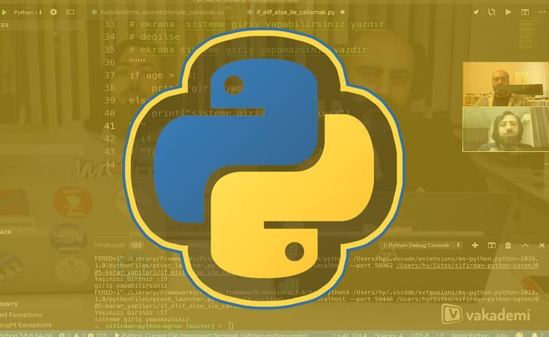

# Hakan Yalçınkaya
#### Developer / Instructor / YouTuber / Content Creator

## Udemy

[Markdown Öğren: Basit ama Çok Güçlü Yazı Biçimi](https://www.udemy.com/course/markdown-ogren-basit-ama-cok-guclu-yaz-bicimi-ile-tanis/)

## Kitap

## Vakademi

[Sıfırdan Python'da Uzmanlaş (15 Saat & 2 Eğitmen)](https://vakademi.com.tr/home/category/yazilim/sifirdan-pythonda-uzmanlas/)

## Youtube
