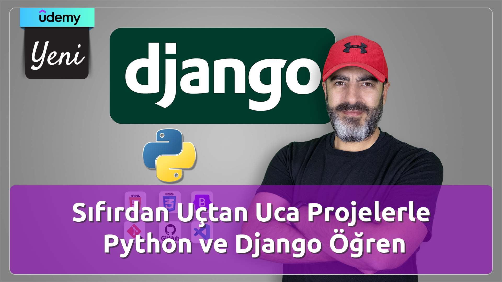

# Hakan Yalçınkaya
#### Developer / Instructor / YouTuber / Content Creator

## Udemy

[Udemy: Sıfırdan Uçtan Uca Projelerle Python ve Django Eğitimi](http://lnk.ktlzr.co/gtdj)
********************************

[İki Eğitmen ile Sıfırdan Python Öğren](http://lnk.ktlzr.co/gtupy)

********************************

[Emmet ile HTML ve CSS'te Hızlı Kodlama Teknikleri Öğrenin](http://lnk.ktlzr.co/gtemt)

********************************

[Markdown Öğren: Basit ama Çok Güçlü Yazı Biçimi](http://lnk.ktlzr.co/gtmrk)
********************************
## Kitap

********************************
## Youtube
